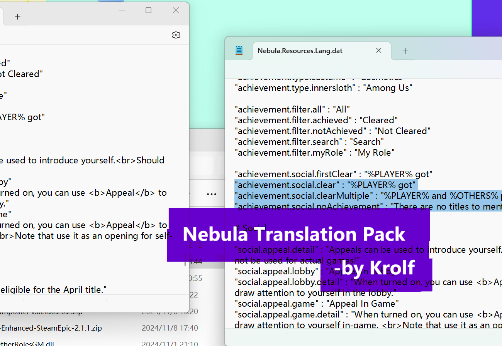

# About this Pack

> ### Introduction
>
> This pack is created by Krolf, the chef editor. This Pack is represented for concise and readable. It'll update in 24 hours when the Mod NoS updates.
 
 
 
 
 
 

---
## The Mod : Nebula 
This is the Mod [Nebula On The Ship](https://github.com/Dolly1016/Nebula)
## Translation
This pack includes:  -Basic contents  -Archievement  -Color
## Contact us
If you have any questions, you can ask at <b>issues</b> Or my(Khcell)<b> E-mail</b>:Khell.hoshino@outlook.com
